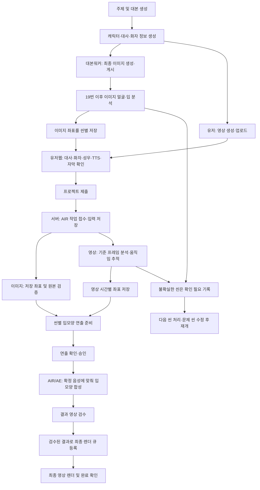

# AIR STUDIO 얼굴·입 분석 및 입모양 작업 전체 프로세스

최종 정리: 2026-10-09 · 구현 기준: `534586cb`

이 문서는 이미지 생성부터 영상 제출, 얼굴·입 좌표 저장, AIR 입모양 합성, 검수와 최종 렌더까지의 현재 실행 흐름을 설명한다. 이전 문서의 “영상도 제출 전에 좌표를 반드시 저장해야 한다”는 설명은 제출 시 자동 분석 기능으로 대체한다.

## 1. 처리 시점과 담당

**이미지는 대본워커에서 이미지 생성·게시 직후 얼굴·입을 분석하고 좌표를 저장한다. 영상은 유저가 생성·업로드한 뒤 프로젝트를 제출하면 통합워커가 분석·추적하고 좌표를 저장한다.**

| 작업 | 정지 이미지 씬 | 유저가 업로드한 영상 씬 |
|---|---|---|
| 원본 제작 | 대본/이미지 워커 | 유저 |
| 자동 분석 시작 시점 | 최종 이미지 생성·게시 직후 | 유저의 프로젝트 제출·재제출 후 |
| 분석 담당 | 대본워커의 로컬 Codex CLI | 통합워커의 로컬 Codex CLI 및 영상 추적기 |
| 현재 자동 분석 범위 | 19번 이후의 게시 이미지 | 대사가 있는 원본 영상. 1~18번 포함, 이후 영상 씬도 포함 |
| 분석 결과 | 화자별 정규화 얼굴·입 좌표 | 화자별 기준 좌표와 시간별 얼굴·입 좌표, 이동·크기·회전 |
| 수동 지정 | 잘못되거나 불확실한 좌표 보완 | 추적 기준 좌표 보완 및 자동 분석 실패 확인 |
| 실제 입모양 합성·렌더 | 제출 후 확정 음성에 맞춰 AIR/AE 워커가 실행 | 제출 후 분석 결과와 확정 음성을 이용해 AIR/AE 워커가 실행 |

여기서 **얼굴·입 분석 및 좌표 저장**과 **입을 움직이는 영상의 합성·렌더**는 서로 다른 단계다. 현재 대본워커가 이미지 생성 시 수행하는 것은 전자다. 이미지도 실제 입모양 렌더는 유저가 확정한 대사·성우·TTS 시간을 받은 뒤 진행한다.

## 2. 전체 흐름



각 씬의 완료 결과는 즉시 저장한다. 한 씬의 분석 실패 때문에 다른 씬의 결과를 버리거나 전체 분석을 처음부터 다시 시작하지 않는다. 단, DB 저장 자체의 실패·입력 변경·작업 점유 상실은 안전하게 중단하거나 재시도해야 한다.

## 3. 이미지 경로: 대본워커에서 분석·저장

실행 연결:

```text
worker/cowork_scene_assets.py publish
  → 최종 크롭·업스케일 PNG를 GCS 및 토픽 씬에 게시
  → worker/generated_speaker_coordinates.py analyze_published_scenes
  → 로컬 Codex CLI로 최종 PNG의 얼굴·입 분석
  → 씬별 로컬 결과 파일 및 DB 저장
```

1. 현재 대본의 해시와 일치하는 `dialogue_annotations`에서 확정된 화자를 읽는다.
2. 이미지 생성 프롬프트나 전체 그리드가 아니라 실제 게시된 최종 PNG를 Codex에 첨부한다.
3. 각 화자의 화면 등장 여부, 얼굴 전체 영역, 입술과 주변 피부 영역을 분석한다. 좌표는 원본 이미지 기준 0~1 정규화 값이다.
4. 대사가 없으면 `not_required`, 유효한 좌표가 있으면 `ready`, 화자 정보 누락·불확실한 얼굴·분석 실패 등은 `needs_review`로 기록한다.
5. 결과를 씬마다 저장한 뒤 다음 씬으로 진행한다. DB 저장 충돌·실패를 분석 완료로 처리하지 않는다.

저장 위치:

- DB: `topics_queue.pregenerated_structure.scenes[].metadata.cowork_image_asset.speaker_geometry`
- 로컬: 게시 이미지 폴더의 `scene-NNN-speaker-coordinates.json`
- 주요 필드: 상태, 화자별 얼굴·입 좌표, 캐릭터 정보, 원본 버킷·경로·SHA-256, 결과 식별값, 오류 사유

웹과 AIR 제출 경로는 최신 토픽의 좌표를 기존 `ae_speaker_coordinates` 형식으로 읽는다. 현재 프로젝트의 이미지 경로·캐릭터·화자와 맞는 결과만 사용하며, 실제 원본 해시도 확인한다. **유저가 웹에서 직접 확정한 좌표가 우선한다.**

동일한 이미지·대본 주석·캐릭터의 성공 결과는 재사용한다. 변경된 이미지는 다시 분석한다. 기존 완료 프로젝트 전체에 자동으로 소급 실행하지 않으며, 이미지 게시 또는 게시 명령 재실행 시 동작한다.

## 4. 유저웹 준비 및 제출

1. 유저가 생성한 영상클립을 이미지 페이지의 해당 씬에 업로드한다.
2. 대사/내레이션 구분, 화자와 성우 연결, 자막 및 TTS를 확인·저장한다.
3. 필요한 이미지·영상·음성·썸네일이 준비되면 프로젝트를 제출한다.
4. 제출 API가 현재 대본·화자·확정 음성·씬 시간·원본 미디어를 검증하여 작업 입력을 저장한다.
5. `ensureAeMouthJob`가 `ae_mouth_job`을 접수하고 `auto_video_coordinates: true`를 기록한다.

**영상 업로드만으로 제출 후 분석이 시작되지는 않는다. 프로젝트 제출이 시작 조건이다.** 제출 HTTP 요청은 영상 분석이 끝날 때까지 기다리지 않는다. 큐에 접수한 뒤 통합워커가 백그라운드에서 처리한다.

## 5. 영상 경로: 제출 후 통합워커에서 분석·저장

실행 연결:

```text
프로젝트 제출·재제출
  → auth-web/lib/stdAeMouthQueue.ts
  → DB의 ae_mouth_job
  → worker/ae_mouth_worker.py discovery 단계
  → worker/submitted_video_coordinates.py
  → 첫 프레임 분석 또는 기존 수동 좌표 사용
  → worker/ae_video_tracking.py 시간별 추적
  → GCS 좌표 파일 + DB 결과 참조 저장
  → 씬별 연출 확인 단계
```

1. 저장된 자막에서 실제 대사가 있고 화자가 확정된 원본 영상 씬을 선택한다. 번호가 1~18이라는 이유로 제외하지 않는다.
2. 원본 영상을 내려받아 파일 해시를 계산하고 첫 프레임을 추출한다.
3. 기존 수동 좌표가 있으면 기준 이미지와 해시를 검증한 뒤 추적 기준으로 사용한다. 수동 좌표를 자동 분석 결과로 덮어쓰지 않는다.
4. 좌표가 없으면 로컬 Codex CLI가 실제 첫 프레임과 캐릭터 정보를 보고 얼굴·입 영역을 찾는다.
5. 영상 추적기가 프레임 사이의 움직임을 추적한다. 시간별 얼굴·입 좌표, 이동량, 크기와 회전을 기록한다.
6. 기준 프레임과 전체 좌표 JSON을 저장하고 DB에 결과 참조를 기록한다. 각 씬 작업 결과에도 `video_coordinate_asset_id`를 기록한다.
7. 다음 씬으로 넘어간다. 분석에 실패한 씬은 `needs_review`와 원인을 저장한다.

현재 자동 추적은 첫 프레임을 기준으로 한다. 첫 프레임에서 화자를 찾지 못하거나 얼굴 가림·큰 회전·장면 전환으로 추적 신뢰도가 낮으면 확인 필요로 남긴다. 첫 프레임의 부재를 영상 전체의 화면 밖 상태로 간주하지 않는다. 이 경우 사용자 확인이나 원본 수정이 필요할 수 있다.

저장 위치:

```text
GCS:
std-projects/<project-id>/video-coordinates/<video-id>/<fingerprint>/
  reference.png
  coordinates.json

DB:
std_project_assets
  metadata.kind = submitted_video_coordinates
  metadata.state = ready
```

DB에는 원본 영상 ID·SHA-256, 좌표 파일 경로·SHA-256, 기준 프레임, 추적 요약, 수동 좌표 사용 여부를 저장한다. 전체 프레임별 좌표는 GCS JSON에 저장한다.

`coordinates.json`의 화자별 `tracking`에는 `at_seconds`, `face_box`, `mouth_box`, `offset`, `scale`, `rotation`이 들어간다. 추적은 해당 씬에서 사용하는 영상 구간을 대상으로 하며, 클립 종료 뒤의 정지 구간은 마지막 위치를 이용한다.

같은 영상·화자·수동 좌표·시간 조건이면 결과를 재사용한다. 재개 시 원본 영상, 좌표 파일과 기준 프레임의 해시를 검증한다. 연출 승인 후 렌더 단계에서 좌표를 임의로 재분석하지 않는다.

## 6. 공통 AIR 입모양 합성·검수·최종 렌더

이미지와 영상은 좌표를 준비하는 시점이 다르지만, 실제 입모양 합성 단계는 확정된 음성을 사용한다.

1. 이미지 씬은 대본워커 또는 유저가 저장한 좌표를 원본 이미지와 대조한다. 영상 씬은 제출 후 저장한 추적 결과를 사용한다.
2. 실제 대사를 말하는 화자만 대상으로 연출 지침을 준비한다. 내레이션·쉼·다른 화자의 대사에서는 해당 인물의 입을 다문다.
3. 연출 확인 후 닫힘·반열림·열림의 입 패치를 만들고 확정 음성의 진폭과 대사 시간에 맞춰 합성한다. 현재 구현은 음소별 정밀 립싱크가 아닌 세 가지 입 모양의 발화 애니메이션이다.
4. 영상은 원본을 1배속으로 유지하고 입 위치를 추적한다. 클립이 먼저 끝나면 마지막 화면을 유지하고 남은 씬 구간에 줌인과 입 움직임을 적용한다.
5. 출력 길이가 확정 TTS 시간과 맞는지 확인한 뒤 결과 영상을 저장한다.
6. 실제 원본·음성·연출·출력 영상을 확인하여 검수한다. 승인된 결과만 최종 렌더에 사용한다.
7. `scripts/std_continue_submission.cjs`가 현재 입력과 검수 결과를 확인하고 최종 렌더 큐에 연결한다. 큐 등록과 최종 렌더 완료는 별도로 확인한다.

```text
queued → processing → direction_pending
  → 연출 확인 → direction_approved → processing
  → review_pending → 출력 검수 → reviewed
  → 최종 렌더 큐 등록 → 최종 영상 완료 확인
```

사용자가 승인한 Codex 감독 흐름에서는 Codex가 실제 자료를 확인한 뒤 연출 승인·검수를 진행할 수 있다. 불확실한 결과를 무조건 승인하지 않는다. 관리자 게시·YouTube 업로드는 별도 단계다.

AIR 출력에는 원본 이미지/영상/음성 ID, 영상 좌표 에셋 ID, 추적 정보, 렌더 해시, 길이와 `timing_locked`를 기록한다.

## 7. 실패·수동 보완·재제출 규칙

| 상황 | 처리 |
|---|---|
| 대사가 없는 씬 | 입모양 작업 제외, 원본 미디어 유지 |
| 이미지의 유효한 좌표 없음 | 해당 씬 건너뛰기와 누락 사유 기록. 좌표 보완 후 재제출 |
| 제출된 대사 영상의 좌표 없음 | 자동 첫 프레임 분석·추적 시작. 좌표 누락만으로 바로 제외하지 않음 |
| 영상 분석·추적 실패 | `needs_review`와 사유 저장 후 다음 씬 처리 |
| 유저가 화자를 화면 밖으로 확정 | 해당 화자의 입모양 작업 제외 |
| 영상 첫 프레임에서 자동 식별 불가 | 확인 필요. 영상 전체가 화면 밖이라고 자동 확정하지 않음 |
| 원본·화자·대본·음성 변경 | 이전 결과의 재사용 조건 확인. 맞지 않으면 다시 준비·제출 |
| DB 저장 실패 또는 작업 점유 상실 | 성공으로 표시하지 않음. 작업 중단·재시도 처리 |
| 중단 후 재시작 | 저장된 씬 결과·좌표 파일을 검증해 재사용 |

웹의 얼굴·입 위치 지정 창은 수동 보완 도구다. 영상 기준 프레임은 `speaker_video_reference`로 별도 저장하며 원본 영상을 교체하지 않는다. 기준 프레임의 직접 확정은 영상 전체 추적 완료를 의미하지 않는다.

동일한 이미지·캐릭터·화자인데 기준 정보만 갱신된 경우 직접 그린 영역을 유지한다. 실제 이미지나 화자가 바뀌면 재확인이 필요하다. 일부 화자만 지정한 경우 부분 저장을 사용할 수 있다.

이전 버전에서 좌표 없음으로 건너뛴 영상은 재제출 시 다시 준비하고 다른 씬 결과는 유지한다. 처리 중인 작업과 이미 최종 렌더 큐에 등록된 작업을 강제로 덮어쓰지 않는다. 같은 자동 분석 실패를 제출만으로 무한 반복하지 않으며, 위치 보완이나 명시적 재시도 후 진행한다.

## 8. 실행 환경과 업데이트

| 환경 | 역할 | 적용할 코드 |
|---|---|---|
| Vercel 유저웹 | 저장, 제출, 큐 등록, 진행 상태 조회 | `auth-web/` |
| 대본워커 컴퓨터 | 대본·이미지 생성, 게시 직후 이미지 좌표 분석 | 최신 대본/이미지 워커 소스 및 로컬 Codex CLI |
| Windows 통합워커 컴퓨터 | 제출 영상 분석·추적, AIR/AE 합성, 최종 렌더 | 최신 통합워커 소스, Codex CLI, FFmpeg, 영상 추적 모듈, After Effects |

웹 배포만으로 두 워커 컴퓨터의 실행 중인 Python 코드가 갱신되지는 않는다. 각 컴퓨터에서 로컬 변경을 보존하고 최신 `main`을 받은 뒤 워커를 재시작한다. 폐기된 Windows 데스크톱 앱의 설치 패키지·GitHub Release는 이 흐름의 배포 대상이 아니다.

권장 통합워커 실행 경로:

```text
python -m worker.launch --role local
  → worker.local_media_supervisor
  → ae 역할
  → ae_mouth_worker.py --once --mouth-only
```

제출 영상의 자동 좌표 분석은 이 `ae` 역할 안에서 실행한다. 웹에서 사용자가 별도로 요청하는 선택 씬 분석은 기존 `coordinates` 역할이 처리한다. 별도 관리자 진입점의 `full`·`render_only` 프로필에도 `ae_mouth_worker`가 포함된다. 같은 컴퓨터에서 supervisor와 관리자를 중복 실행하지 않는다.

Windows 적용 예시:

```powershell
python -m worker.local_media_supervisor --stop
python -m worker.local_media_supervisor --status
# 진행 중 작업 종료 및 stopped 확인 후, 실제 워커 소스 폴더에서 실행
# git status로 로컬 변경을 먼저 확인·보존

git fetch origin
git merge --ff-only origin/main

python -m worker.launch --role local --env-file worker/connection.env --check
python -m worker.launch --role local --env-file worker/connection.env
```

`--check`는 필요한 모듈·프로그램·연결 설정을 점검한다. 실제 DB 접속 성공과 Codex 로그인까지 보증하는 것은 아니다. 기존 인증과 연결 설정을 유지한다.

## 9. 진행 확인과 저장 데이터 조회

- 웹 작업 조회: `/api/std/projects/<project-id>/ae-mouth`. 씬별 결과, `coordinateState`, `trackedFrames`, 보호된 `coordinateUrl`을 반환한다.
- 로컬 상태 화면: `http://127.0.0.1:3004`
- 로그: `logs/local-media/ae.log`, `logs/ae_mouth_worker.log`
- 상태 파일: `state/ae_mouth_worker.json`. 실제 경로는 `AIRWORKER_HOME` 설정에 따른다.
- DB 작업: `std_project_assets.metadata.kind = ae_mouth_job`의 `state`, `results`, `input`
- 이미지 좌표: 토픽 씬의 `cowork_image_asset.speaker_geometry`
- 영상 추적 좌표: `submitted_video_coordinates` 에셋 및 연결된 GCS JSON

좌표 준비 완료, 수동 확정, 영상 추적 완료, AIR 영상 생성 완료, 결과 검수 완료, 최종 렌더 완료는 각각 다른 상태다. 좌표 수치를 AIR 렌더 완료 수치로 해석하지 않는다.

에셋 조회는 페이지 끝까지 읽어 원본이 1,000개 이후에 있어도 누락하지 않는다. 작업은 DB 소유 토큰과 heartbeat로 중복 점유를 방지한다. 워커 진행률은 씬 결과 저장 비율이며 Adobe 인코딩 백분율이 아니다.

## 10. 검증 범위

제출 영상 자동 분석 연결 변경(`534586cb`)은 Python 31개·웹 21개 테스트와 Next.js production build를 통과했다. 실제 이동 영상의 프레임별 좌표 저장·재사용, 수동 좌표 우선, 원본 변경·손상 결과 차단, 실패 후 다음 씬 처리, 재제출 시 부분 재개를 확인했다.

Codex 응답과 DB/GCS는 테스트 대역을 사용했다. 운영 영상 전체의 실제 Codex 분석 완료나 별도 Windows AE 출력의 시청 검수 완료를 뜻하지 않는다. Next.js 빌드는 저장소 설정상 전체 TypeScript/lint 검사를 생략한다.

앞선 12번 씬의 직접 확정 저장 확인은 해당 기준 프레임의 수동 좌표 저장에 대한 증거다. 이 기록을 제출 후 영상 전체 자동 추적이나 최종 렌더 완료로 간주하지 않는다.
