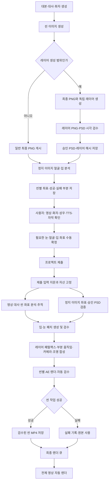

# AIR Studio 이미지·레이어·AE 자동 후작업 전체 프로세스

최종 갱신: 2026-10-10

기준 계약: `scene_direction_plan/v1`

연출 프로필은 대본 워커 입력의 `direction_profile`로 선택하고 최종 구조와 각 씬 계획에 함께 저장한다.

| 프로필 | ID | 용도 |
|---|---|---|
| 기본 영상 연출 | `standard` | 일반적인 대사·내레이션 영상 |
| 일본옛날이야기 | `japanese_folktale` | 일본 시대극·설화의 여백, 절제된 이동, 계절·등불 분위기 |
| 세로형 웹툰 속도연출 | `vertical_webtoon_speed` | 원본 세로 PSD의 위→아래 읽기 순서, 가감속, 충격 정지, 승인 레이어 패럴랙스 |

`auto`를 선택하면 일본어이며 일본 옛날이야기 문맥인 콘텐츠는 `japanese_folktale`, 무빙툰이며 웹툰 스타일인 콘텐츠는 `vertical_webtoon_speed`, 나머지는 `standard`가 된다. 연출 프로필은 효과 허용 목록을 우회하지 않는다. 세로형 웹툰도 승인된 PSD 레이어만 움직이며 말풍선과 필수 글자의 가독 시간, 레이어 순서, 화면 크롭과 투명 경계를 검수한다. `02f_scene_visual_director`는 `gpt-6-astra`와 `high` 추론 강도로 프로필 지침을 적용한다.

이 문서는 대본 워커가 씬을 준비하는 시점부터 사용자가 프로젝트를 제출하고, AIR STUDIO 통합 워커가 씬별 AE 후작업과 최종 렌더를 끝낼 때까지의 현재 실행 계약을 설명한다. 웹 화면의 준비 수치, 좌표 준비, AIR 작업 완료, 최종 렌더 완료는 서로 다른 상태이며 같은 의미로 사용하지 않는다.

## 1. 담당과 실행 시점

| 단계 | 담당 | 실행 시점 | 주요 결과 |
| --- | --- | --- | --- |
| 대본·대사·화자 생성 | 대본 워커 | 프로젝트 생성 | 대본, 화자, 대사·내레이션 구분 |
| 이미지와 선택 레이어 생성 | 대본/이미지 워커 | 이미지 제작 | 일반 PNG 또는 검수 대상 레이어 PNG·PSD |
| 정지 이미지 얼굴·입 분석 | 대본 워커의 로컬 Codex CLI | 최종 이미지 게시 직후 | 화자별 얼굴·입 좌표, 원본 해시 |
| 수동 좌표·눈 깜빡임 지정 | 사용자 웹 | 제출 전 | 사용자 확정 얼굴·입·눈 좌표 |
| 영상 업로드 | 사용자 | 제출 전 | 씬에 연결된 원본 영상 |
| 영상 얼굴·입 분석·추적 | AIR STUDIO 통합 워커 | 프로젝트 제출 후 | 기준 좌표와 시간별 이동·크기·회전 |
| AE 씬 후작업 | AIR STUDIO 통합 워커 | 좌표·레이어 검증 후 | 씬별 검수 대상 MP4 |
| 최종 영상 조립 | 최종 렌더 워커 | 필수 결과가 승인 또는 건너뛰기로 확정된 뒤 | 전체 프로젝트 MP4 |

레이어 생성은 움직일 수 있는 원본을 준비하는 단계다. 패럴랙스, 부분 움직임, 조명, 눈·입 교체와 실제 영상 렌더는 사용자 제출 이후의 AE 후작업 단계에서 실행한다.

## 2. 전체 흐름



각 씬 결과는 완료되는 즉시 저장한다. 한 씬의 분석·생성·AE 렌더 실패가 다른 씬의 성공 결과를 지우거나 전체 작업을 처음부터 다시 시작하게 만들면 안 된다.

### 2.1 대본 워커 연출 디렉팅

대본 워커는 이미지 프롬프트를 만들기 전에 각 씬의 이야기 역할과 연출 목적을 정한다. 이 결과는 `scene_direction_plan/v1`로 저장되며 이미지 워커, 제출 스냅샷, AE 워커가 동일한 값을 사용한다. 따라서 효과를 구현했다고 해서 모든 씬에 임의 효과가 붙는 구조가 아니다.

씬마다 다음 항목을 결정한다.

| 항목 | 규칙 |
| --- | --- |
| `scene_role` | 대사, 반응, 단서 공개, 장소, 긴장, 전환, 해결, 내레이션, 정지 중 하나 |
| `dramatic_intent` | 관객이 이 씬에서 이해하거나 느껴야 할 한 가지 목적 |
| `focus_target` | 초점을 둘 캐릭터·소품·레이어와 0~1 좌표 |
| `primary_effect` | 주 연출 하나. 움직임이 불필요하면 `hold` |
| `secondary_effects` | 보조 연출 최대 두 개 |
| `timed_beats` | 시작·종료 시간, 동작, 대상 |
| `required_layers` | 선택한 연출에 실제로 필요한 레이어만 요청 |
| `effect_limits` | 강도·속도·확대·이동·회전 상한 |
| `fallback` | 검증 또는 렌더 실패 시 사용할 원본 정책 |
| `qa_assertions` | 연출 의도가 결과에서 확인되는 조건 |

대본 워커는 인접 씬에 같은 눈에 띄는 주 효과를 반복하지 않고, 대사·반응·단서·전환의 리듬에 맞춰 정지 씬을 섞는다. 주 연출은 정확히 하나, 보조 연출은 최대 두 개만 허용한다. 선택한 효과는 `ae_operations`에도 있어야 하며 필요한 레이어가 없으면 일반 줌으로 몰래 대체하지 않는다. 연출에 필요한 레이어가 있으면 이 계획이 이미지 워커의 레이어 생성 명세가 된다.

실행 단계에서는 계획을 다시 추측하지 않는다. 정지 이미지는 저장된 초점과 강도 한도를 그대로 사용하고, 사용자 업로드 영상은 제출 후 실제 영상 프레임을 검토해 같은 계약을 최종 확정한다. 영상에 보이지 않는 표정·신체 동작이나 준비되지 않은 레이어가 필요하면 해당 선택 효과만 건너뛰고 원본을 사용한다.

## 3. 대본 워커: 이미지와 레이어 준비

### 3.1 일반 이미지 씬

레이어 범위로 지정되지 않은 씬은 기존과 같이 최종 합성 PNG 한 장을 생성한다. 대본 워커는 최종 이미지의 GCS 위치와 SHA-256을 저장하고 얼굴·입 분석을 실행한다. AE는 이 이미지를 이용해 전체 이미지 줌·패닝 같은 안전한 카메라 효과를 적용할 수 있다.

### 3.2 레이어 생성 범위

대본 워커 옵션의 `image_layer_scene_start`와 `image_layer_scene_end`로 지정한 씬만 `parallax_layered_scene` 패키지를 만든다. 예를 들어 19~35씬을 지정하면 해당 범위만 레이어 생성 대상이 된다.

필수 레이어는 다음 세 개다.

| 레이어 | 내용 | 기본 후작업 |
| --- | --- | --- |
| `background` | 인물과 움직일 소품이 제거된 전체 배경판 | 낮은 깊이 이동, 제한된 블러 |
| `character` | 주인공 또는 분리할 수 없는 주요 인물 그룹 | 이동·회전·확대, 눈·입 패치의 부모 레이어 |
| `foreground` | 화면 앞쪽의 환경 가림 요소 | 가장 큰 깊이 이동, 인물 앞 가림 |

장면 대본과 이미지 프롬프트에 실제 근거가 있을 때만 다음 선택 레이어를 생성 대상으로 올린다.

| 선택 레이어 | 선택 근거 예 | 허용 작업 |
| --- | --- | --- |
| `prop_focus` | 검, 책, 편지, 등불, 부채, 잔 등 | 이동·회전·확대 |
| `hair_cloth` | 머리카락, 옷자락, 소매, 치마, 망토, 리본 등 | 승인된 부분의 작은 흔들림 |
| `atmosphere` | 안개, 먼지, 비, 눈, 연기 등 | 투명도 변화, 느린 분위기 효과 |
| `light_overlay` | 등불, 촛불, 창빛, 월광, 햇빛 등 | 제한된 밝기 변화와 가산 합성 |

선택 레이어가 필요하지 않은 장면에 효과를 만들기 위해 새 물체·빛·안개를 임의로 추가하지 않는다. 선택된 레이어도 필수 레이어와 동일하게 독립 PNG 생성과 시각 검수를 통과해야 한다.

### 3.3 레이어 파일 계약

- 모든 레이어는 1920×1080 전체 캔버스 PNG다.
- `background`는 전체 캔버스를 덮는 불투명 이미지다.
- 나머지 레이어는 투명 배경에 실제로 보이는 픽셀이 있어야 한다.
- 각 레이어는 최종 이미지와 같은 위치·비율·카메라 구도를 유지한다.
- PSD의 실제 레이어 이름과 승인 기록의 레이어 목록이 정확히 같아야 한다.
- 원본 이미지, 각 PNG, PSD의 SHA-256을 저장한다.
- PSD의 `qa_status`가 `approved`이고 실제 파일 해시가 승인 해시와 같을 때만 AE가 사용한다.

레이어 패키지의 시각 검수가 실패하면 평면 미리보기나 자동 분할 결과를 대신 사용하지 않는다. 해당 씬은 원본 PNG를 유지한다.

### 3.4 기존 레이어 패키지 호환 규칙

이전의 `background`·`foreground` 2레이어 PSD는 새 계약의 `character` 레이어가 없으므로 새 패럴랙스·부분 교체 입력으로 사용할 수 없다. 기존 씬에 새 기능을 적용하려면 최종 이미지를 기준으로 레이어 패키지를 다시 생성하고 승인해야 한다. 워커는 부족한 PSD를 자동 승인하거나 캐릭터 레이어를 임의로 추정하지 않는다.

### 3.5 썸네일과 일반 미리보기

레이어 씬도 사용자 웹의 썸네일에는 기존과 같은 최종 합성 이미지가 표시된다. PSD 내부 레이어를 썸네일에서 따로 노출하지 않는다. AE 후작업 결과가 준비되면 큰 미리보기와 최종 렌더는 검수된 씬 영상을 우선 사용한다.

## 4. 대본 워커: 정지 이미지 얼굴·입 분석

대본 워커는 최종 이미지가 게시된 뒤 다음을 수행한다.

1. 최종 PNG, 대본, `dialogue_kind`, `dialogue_speaker`, 캐스트를 묶어 입력 지문을 만든다.
2. 로컬 Codex CLI가 실제 최종 PNG를 보고 화자별 화면 등장 여부, 얼굴 영역과 입 영역을 분석한다.
3. 좌표를 이미지 폭·높이 기준 0~1 정규화 값으로 저장한다.
4. 이미지 ID·GCS 경로·SHA-256과 분석 결과를 함께 저장한다.
5. 유효한 씬은 `ready`, 불확실하거나 가려진 씬은 `needs_review`, 대사가 없는 씬은 `not_required`로 기록한다.
6. 성공한 씬을 즉시 저장하고 다음 씬으로 진행한다.

유저가 웹에서 확정한 좌표가 자동 분석보다 우선한다. 이미지·화자·캐스트가 바뀌면 해당 씬 좌표만 무효화한다. 좌표 실패 때문에 다른 씬의 이미지 생성이나 좌표 저장을 중단하지 않는다.

주요 저장 위치는 다음과 같다.

```text
topics_queue.pregenerated_structure.scenes[].metadata.cowork_image_asset.speaker_geometry
게시 이미지 폴더/scene-NNN-speaker-coordinates.json
```

## 5. 사용자 웹: 제출 전 확정

사용자는 제출 전에 다음 내용을 확인한다.

1. 1~18씬을 포함한 영상 씬에 실제 사용할 영상을 업로드한다.
2. 영상을 교체하면 새 영상이 현재 원본이 되며 이전 영상은 재사용 대상에서 제외한다.
3. 자막별 대사·내레이션 구분과 화자를 확인한다.
4. 캐릭터 성우와 내레이션 성우를 확인하고 최종 TTS를 생성한다.
5. 자동 얼굴·입 분석이 불확실한 이미지 씬은 얼굴 전체와 입 영역을 직접 지정한다.
6. 원하는 정지 이미지 씬과 캐릭터에 양쪽 눈 영역과 깜빡임 간격을 지정한다.
7. 이미지, 영상, 자막, TTS, 썸네일과 설정이 준비되면 프로젝트를 제출한다.

영상 좌표 분석은 영상 업로드 직후가 아니라 프로젝트 제출 후 시작한다. 영상은 유저가 최종 파일을 교체할 수 있으므로 제출 시점의 실제 원본을 분석 기준으로 삼는다.

## 6. 제출 입력 고정과 무효화 조건

제출 API는 현재 입력을 읽어 `ae_mouth_job`과 입력 지문을 만든다. 주요 입력은 다음과 같다.

```text
프로젝트·씬 번호와 시간
최종 자막 텍스트와 대사·내레이션 분류
화자와 성우
최종 TTS 자산과 자막 타임라인
현재 원본 이미지·영상 ID와 메타데이터
얼굴·입 좌표와 사용자 확정 여부
눈 깜빡임 계획
AE 연출 계획
승인 PSD 위치·레이어 목록·SHA-256
```

다음 변경은 관련 씬의 기존 작업 지문을 무효화한다.

- 원본 이미지 또는 영상 교체
- PSD·레이어 목록·승인 해시 변경
- 자막 텍스트·대사 분류·화자·성우 변경
- TTS 또는 자막 시간 변경
- 얼굴·입·눈 좌표 변경
- 씬 AE 연출 계획 변경

변경되지 않은 씬의 완료 결과는 유지한다. 처리 중인 입력이 바뀌면 워커는 오래된 결과를 현재 프로젝트에 연결하지 않는다.

## 7. 통합 워커: 영상 얼굴·입 분석

대사가 있는 영상 씬은 제출 후 다음 순서로 분석한다.

1. 현재 제출에 연결된 원본 영상을 내려받고 SHA-256을 계산한다.
2. 기준 프레임을 추출한다.
3. 사용자 확정 좌표가 있으면 원본 일치 여부를 검사한 뒤 우선 사용한다.
4. 좌표가 없으면 로컬 Codex CLI가 실제 기준 프레임에서 화자의 얼굴·입을 분석한다.
5. 영상 추적기가 프레임별 위치, 크기와 회전을 추적한다.
6. 기준 프레임과 전체 좌표 JSON을 GCS에 저장하고 DB에 자산 참조를 기록한다.
7. 실패 사유를 씬 결과에 저장하고 다음 씬으로 진행한다.

```text
GCS
std-projects/<project-id>/video-coordinates/<video-id>/<fingerprint>/
  reference.png
  coordinates.json

DB
std_project_assets.metadata.kind = submitted_video_coordinates
```

영상 첫 프레임에서 얼굴이 보이지 않거나 큰 회전·가림·장면 전환으로 추적 신뢰도가 낮으면 해당 입모양 작업을 건너뛸 수 있다. 좌표가 없다는 이유로 영상 씬 전체를 삭제하지 않으며 원본 영상은 최종 렌더에 계속 참여한다.

## 8. 통합 워커: 입·눈 부분 교체

입모양은 확정 TTS와 실제 대사 시간에 맞춰 닫힘·반열림·열림의 세 패치를 생성한다. 현재 구현은 음소별 정밀 립싱크가 아니라 음성 진폭과 대사 시간에 따른 세 단계 발화 애니메이션이다.

눈 깜빡임은 사용자가 지정한 캐릭터와 양쪽 눈 좌표가 있을 때만 닫힌 눈 패치를 생성한다. 다음 조건을 모두 만족해야 사용한다.

- 좌표가 저장된 이미지와 현재 이미지 ID·SHA-256이 같다.
- 양쪽 눈 패치가 지정 영역 안에 있다.
- 패치 생성 결과가 시각 검수를 통과한다.
- 저장된 깜빡임 간격이 유효하다.

레이어 씬에서는 입·눈 패치를 평면 완성본 위에 별도 렌더하지 않는다. 승인된 `character` 레이어의 자식으로 같은 AE 컴포지션에 넣는다. 따라서 캐릭터가 이동·회전·확대될 때 입과 눈도 함께 움직이고, 패럴랙스 결과와 입모양 결과가 서로 덮어쓰지 않는다.

## 9. 통합 워커: 레이어별 AE 후작업

승인된 `parallax_layered_scene` PSD에서는 다음 기능을 사용할 수 있다.

### 9.1 2.5D 패럴랙스

- 배경, 캐릭터, 전경에 서로 다른 깊이 계수를 적용한다.
- 배경은 가장 작게, 전경은 가장 크게 이동·확대한다.
- 실제 3D 깊이 추정 결과를 강제 사용하지 않는다.
- 모든 값은 저장된 `layer_animation` 계획과 안전 제한 안에서만 적용한다.

### 9.2 캐릭터·소품 변형

- `character`와 `prop_focus`를 독립적으로 이동·회전·확대할 수 있다.
- 이동은 각 축 최대 화면의 3%, 확대는 최대 10%, 회전은 최대 1도로 제한한다.
- 원본에 없던 포즈, 표정, 관절 굽힘이나 보행을 새로 만들지 않는다.

### 9.3 머리카락·옷자락 움직임

- 승인 PSD에 `hair_cloth` 레이어가 실제로 있을 때만 실행한다.
- 레이어의 실제 알파 중심을 회전 기준으로 사용한다.
- 흔들림은 최대 1.5도로 제한한다.
- 가려진 머리카락·옷·신체를 자동 복원하지 않는다.

### 9.4 조명·안개·블러·가림 순서

- `background`에는 제한된 블러를 적용할 수 있다.
- 캐릭터·전경·소품도 계획에 블러 값이 있을 때만 개별 적용한다.
- `atmosphere`는 화면 합성 모드와 제한된 투명도 변화로 처리한다.
- `light_overlay`는 가산 합성과 제한된 투명도 변화로 처리한다.
- 기본 가림 순서는 배경 → 캐릭터·눈·입 → 머리카락/옷자락 → 전경 → 소품 → 분위기 → 광원이다.
- 승인 PSD에 없는 레이어를 AE가 자동 생성하지 않는다.

### 9.5 카메라 줌·패닝과 재사용

- 카메라 이동은 각 레이어에 공통 카메라 값과 깊이 계수를 합성해 적용한다.
- 카메라 줌은 최대 8%, 패닝은 각 축 최대 화면의 3%로 제한한다.
- 동일한 승인 PSD와 동일한 계획·좌표·TTS 입력이면 체크포인트와 완료 결과를 재사용한다.
- 어느 입력 해시라도 바뀌면 관련 씬만 다시 처리한다.

### 9.6 눈·입 부분 교체

- 검증된 얼굴·입·눈 좌표만 사용한다.
- 입과 눈 패치는 `character` 레이어 움직임을 상속한다.
- 좌표가 없거나 검수에 실패하면 해당 부분 교체만 건너뛴다.
- 부분 교체 실패 때문에 패럴랙스가 가능한 원본 레이어 씬 자체를 폐기하지 않는다.

## 10. 씬별 렌더와 결과 선택

통합 워커의 주요 실행 구성은 다음과 같다.

- `ae_mouth_worker`: 제출 입력 고정, 영상 좌표 분석, 입·눈 패치 생성, 승인 PSD와 결합된 AE 씬 렌더, 자동 검수
- `ae_highlight_worker`: 승인 PSD 패럴랙스·영역 연출, 일반 이미지/영상 카메라·효과, 영상 끝 고정 프레임 처리
- `premiere_final_worker` 또는 원격 렌더 역할: 씬 결과와 원본을 시간순으로 조립
- `remote_drive_worker`: GCS 렌더 패키지 처리와 결과 등록

입·눈 작업과 레이어 작업이 모두 필요한 씬은 `ae_mouth_worker`가 승인 PSD를 입력으로 사용해 한 번의 AE 씬 렌더로 합친다. 별도 입모양 결과가 레이어 결과를 덮어쓰는 방식으로 처리하지 않는다.

최종 렌더의 씬 자산 선택 우선순위는 다음과 같다.

1. 현재 입력과 일치하는 검수된 AE 입·눈·레이어 결합 결과
2. 현재 입력과 일치하는 기존 검수 입모양 결과
3. 검수된 일반 씬 후작업 결과
4. 영상 끝 고정·줌인 결과
5. 현재 제출의 원본 영상 또는 원본 이미지

실제 코드에서는 검수된 AE 입·눈 결과가 같은 씬의 기존 입모양 결과보다 최신이면 이를 사용하며, 해당 결과 안에 승인 레이어 효과가 함께 포함된다.

## 11. 실패 격리와 원본 폴백

| 문제 | 처리 |
| --- | --- |
| 대사가 없는 씬 | 입모양 제외, 다른 연출 또는 원본 사용 |
| 이미지 좌표 누락·불확실 | 해당 입·눈 작업만 건너뛰고 원본 유지 |
| 영상 분석·추적 실패 | 실패 사유 저장 후 다음 씬 처리, 원본 영상 유지 |
| 승인되지 않은 PSD | 레이어 후작업에 사용하지 않고 원본 이미지 사용 |
| PSD 레이어 목록·SHA-256 불일치 | 오래된 결과 무효화, 재검수 전까지 원본 사용 |
| 선택 레이어 부재 | 그 선택 효과만 실행하지 않음 |
| 패치 생성·시각 검수 실패 | 입 또는 눈 교체만 건너뜀 |
| AE 씬 렌더 실패 | 재시도 상태 저장; 종료 실패 시 원본 사용 |
| 작업 중단 | 완료 씬 체크포인트를 보존하고 남은 씬부터 재개 |
| DB 저장 또는 작업 임대 실패 | 성공으로 표시하지 않고 안전하게 중단·재시도 |

모든 필수 대상 씬은 `approved` 또는 명시적 `skipped` 결과가 하나 있어야 최종 렌더로 넘어간다. 선택 작업의 실패는 원본 자산으로 대체할 수 있지만, 누락된 필수 입력을 성공으로 위장하지 않는다.

## 12. 자동 적용하지 않는 작업

다음 작업은 전용 승인 자산이나 리그 없이 자동 실행하지 않는다.

- SAM·GrabCut 결과만으로 모든 캐릭터와 배경을 자동 분리
- Depth Anything 결과만으로 자동 3D 깊이 배치
- 가려진 팔·다리·몸통·배경의 자동 복원
- 승인 마스크 없는 머리카락·옷자락 움직임
- 관절 굽힘, 걷기, 손 흔들기 같은 자동 신체 리깅
- 원본에 없던 표정·자세·소품 생성
- 모든 씬에 반복되는 임의 파티클
- 불확실한 좌표를 사용한 강제 입모양·눈 깜빡임

이 기능이 필요하면 독립 투명 레이어, 완성된 복원 배경, 관절 리그 또는 사용자가 승인한 마스크를 별도로 준비하고 검수해야 한다.

## 13. 저장 상태와 완료 의미

| 구분 | 상태 예 | 의미 |
| --- | --- | --- |
| 정지 이미지 좌표 | `ready`, `needs_review`, `not_required` | 좌표 준비 결과이며 AE 완료가 아니다. |
| 레이어 패키지 | `pending_visual_review`, `approved` | PSD 생성·검수 상태다. |
| 입모양 연출 | `direction_pending`, `direction_approved` | 렌더 전 연출 검토 상태다. |
| 입·눈 씬 렌더 | `review_pending`, `approved`, `skipped` | 검수 영상 또는 원본 폴백이 확정됐다. |
| 일반 AE 후작업 | `ready`, `retry_wait`, `needs_attention` | 승인 결과, 재시도, 원본 폴백 상태다. |
| 최종 렌더 큐 | `remote_render_queue` | 최종 렌더 접수 상태이며 렌더 완료와 다르다. |
| 최종 영상 | `completed`와 결과 자산 | 실제 전체 영상 렌더가 끝났다. |

자막 페이지의 `AIR작업 완료` 수치는 씬별 검수 결과를 뜻한다. `위치 준비`, `추가 확인`, `남은 분석` 수치는 얼굴·입 좌표 상태다. 두 수치를 합치거나 같은 완료율로 표시하면 안 된다.

## 14. 배포와 워커 업데이트

| 환경 | 코드 | 배포 방법 |
| --- | --- | --- |
| Vercel 사용자 웹 | `auth-web/` | `main` 연결 프로덕션 배포 |
| 대본/이미지 워커 컴퓨터 | `worker/codex_content_runner.py`, `worker/manga_layer_generation.py`, `worker/manga_layer_package.py` 등 | 최신 `main`을 받고 워커 재시작 |
| AIR STUDIO 통합 워커 컴퓨터 | `worker/ae_mouth_worker.py`, `worker/ae_highlight_worker.py`, `worker/manga_ae_templates.py` 등 | 최신 `main`을 받고 통합 워커 재시작 |

웹 배포만으로 별도 컴퓨터에서 실행 중인 Python 워커가 갱신되지는 않는다. 레이어 생성과 AE 합성을 실제 적용하려면 각 워커 컴퓨터에서 최신 커밋을 받아야 한다.

```powershell
git status
git fetch origin
git merge --ff-only origin/main

python -m worker.launch --role local --env-file worker/connection.env --check
python -m worker.launch --role local --env-file worker/connection.env
```

진행 중인 작업이 있으면 먼저 정상 종료하고 로컬 변경을 보존한다. 폐기된 Windows 데스크톱 설치 프로그램이나 GitHub Release는 이 웹·워커 배포 흐름의 대상이 아니다.

## 15. 구현 파일 안내

| 역할 | 파일 |
| --- | --- |
| 대본 단계 씬별 연출 계약 | `worker/scene_visual_director.py` |
| 레이어 생성 범위·안전 연출 계획 | `worker/codex_content_runner.py` |
| 독립 레이어 생성 | `worker/manga_layer_generation.py` |
| PSD 조립·해시·승인 계약 | `worker/manga_layer_package.py` |
| 레이어 계획·결과 QA | `worker/manga_scene_qa.py` |
| 패럴랙스·부분 움직임·눈·입 AE JSX | `worker/manga_ae_templates.py` |
| 제출 후 영상 분석·입·눈·결합 렌더 | `worker/ae_mouth_worker.py` |
| 일반 씬 AE 렌더 | `worker/ae_highlight_worker.py` |
| 제출 입력 스냅샷과 무효화 | `auth-web/lib/stdAeMouth.ts` |
| 최종 렌더 자산 선택 | `auth-web/lib/stdRenderQueue.ts` |
| 최종 씬 조립 | `worker/premiere_final_worker.py` |

## 16. 운영 확인 목록

### 대본 워커 완료 확인

- 최종 이미지 ID·GCS 경로·SHA-256이 저장됐는가
- 성공한 얼굴·입 좌표가 씬별로 부분 저장됐는가
- 레이어 범위 씬에 `background`, `character`, `foreground`가 있는가
- 선택 레이어에 실제 장면 근거가 있는가
- PSD 레이어 목록과 승인 해시가 일치하는가

### 사용자 제출 확인

- 현재 영상이 실제 사용할 최신 파일인가
- 모든 자막의 대사·내레이션과 화자가 확정됐는가
- 최종 TTS와 자막 시간이 저장됐는가
- 수동 좌표와 눈 깜빡임 계획이 현재 이미지에 연결됐는가

### 통합 워커 확인

- 제출된 영상에서 기준 프레임과 추적 좌표가 생성됐는가
- 승인 PSD 해시를 다시 검증했는가
- 입·눈 패치가 캐릭터 레이어에 결합됐는가
- 씬별 결과가 승인 또는 건너뛰기로 저장됐는가
- 실패 씬이 다음 씬의 실행을 막지 않았는가

### 최종 렌더 확인

- 모든 씬에 사용할 수 있는 검수 결과 또는 원본이 있는가
- 씬 순서와 길이가 제출 타임라인과 같은가
- 영상·음성·자막 싱크가 맞는가
- 최종 렌더 큐 ID와 완료 자산이 프로젝트에 저장됐는가
