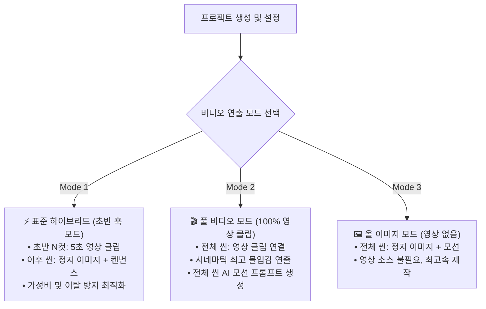
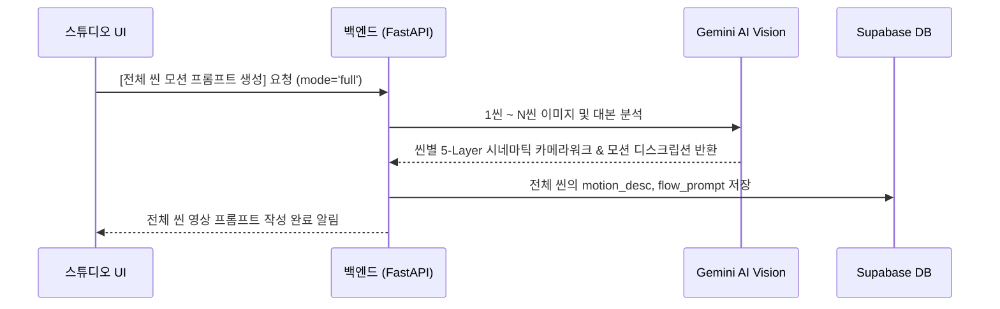

# 🎬 초반 훅 가변화 & 풀 비디오(100% 영상) 제작 파이프라인 기획서

> **작성일자:** 2026-09-21  
> **상태:** 기획 승인 대기 / 설계 완료  
> **관련 모듈:** `auth-web` (Studio UI, Policy, Subtitle/Timeline Sync), `services` (Gemini Video Prompts), `worker` (FFmpeg Video Renderer)

---

## 1. 개요 및 추진 배경

### 1.1 현행 구조 (As-Is)
- 유튜브 롱폼 영상의 초반 이탈 방지(Retention)를 위해 **초반 1분(60초) = 5초 × 12개 씬**이 시스템 전반에 하드코딩되어 있음.
- 1~12씬은 `visual_type = 'video'`(영상 클립 필수), 13씬부터는 `visual_type = 'image'`(정지 이미지)로 고정.

### 1.2 문제점 및 한계
1. **연출의 경직성**: 장르나 채널 스타일에 따라 3초짜리 빠른 템포의 쇼츠형 훅(15~20컷), 혹은 차분한 다큐멘터리형 훅(8초 × 8컷) 등 다양한 호흡을 구성할 수 없음.
2. **풀 비디오(Full Video) 제작 불가**: 전체 씬(53씬+)을 100% 영상 클립으로 이어 붙여 시네마틱한 고몰입 영상을 제작하고자 하는 요구를 수용하지 못함.
3. **영상 클립 수급 부담**: 12개의 비디오 클립을 마련하기 어려운 프로젝트의 경우에도 무조건 12컷이 강제됨.

### 1.3 목표 (To-Be)
- **초반 훅 구간 가변화**: 훅 구간의 씬 개수(0 ~ 24컷)와 씬당 런닝타임(3초 ~ 10초)을 프로젝트별로 자유롭게 설정.
- **풀 비디오(Full Video) 모드 도입**: 1씬부터 마지막 씬까지 전체 씬을 100% 비디오 클립으로 구성 및 렌더링 지원.
- **영상 연출 모드 3단계 표준화**: `초반 훅 모드` / `풀 비디오 모드` / `올 이미지 모드`.

---

## 2. 비디오 커버리지 모드 3단계 정의



| 모드 | 비디오 비율 | 추천 장르 / 용도 | 주요 연출 특징 |
| :--- | :---: | :--- | :--- |
| **1. 초반 훅 모드 (기본)** | **10% ~ 30%**<br>(6 ~ 15컷) | 일반 유튜브 롱폼, 지식·정보, 스토리텔링 | 초반 몰입도 확보 + 제작 시간/비용 최적화 |
| **2. 풀 비디오 모드 (신규)** | **100%**<br>(전체 씬) | 시네마틱 다큐, 영화 리뷰, 역동적 롱폼 | 전 구간이 살아 움직이는 최고 수준 시각 연출 |
| **3. 올 이미지 모드** | **0%**<br>(전체 이미지) | 라디오형 낭독, 명언/수필, 신속 발행 채널 | 비디오 클립 없이 이미지와 오디오로 신속 제작 |

---

## 3. 세부 설계 및 시스템 아키텍처

### 3.1 데이터 모델 설계 (`project_payload.render_settings`)

```json
{
  "render_settings": {
    "video_mode": "full_video", // "hook_only" | "full_video" | "all_image"
    "hook_config": {
      "enabled": true,
      "scene_count": 12,        // 훅 씬 개수 (0 ~ 24)
      "scene_duration": 5.0,    // 훅 씬당 시간 (3.0 ~ 10.0초)
      "total_seconds": 60.0     // scene_count * scene_duration
    },
    "full_video_config": {
      "clip_pacing": "adaptive", // "adaptive"(음성 길이에 씬 자동 맞춤) | "fixed_5s"(5초 균등 분할)
      "clip_fit": "cover",       // "cover"(화면 채움) | "contain"(레터박스)
      "loop_short_clips": true   // 영상 클립이 나레이션보다 짧을 때 자동 순환 재생
    }
  }
}
```

---

### 3.2 정책 및 헬퍼 함수 (`auth-web/lib/stdPolicy.ts`)

```typescript
export const DEFAULT_HOOK_SCENE_COUNT = 12
export const DEFAULT_HOOK_SCENE_DURATION = 5.0

export type VideoMode = 'hook_only' | 'full_video' | 'all_image'

export function getVideoModeConfig(projectPayload?: any) {
    const settings = projectPayload?.render_settings || {}
    const mode: VideoMode = settings.video_mode || 'hook_only'
    const hookConfig = settings.hook_config || {}
    
    return {
        videoMode: mode,
        hookSceneCount: Number(hookConfig.scene_count ?? DEFAULT_HOOK_SCENE_COUNT),
        hookSceneDuration: Number(hookConfig.scene_duration ?? DEFAULT_HOOK_SCENE_DURATION),
        fullVideoConfig: settings.full_video_config || {
            clip_pacing: 'adaptive',
            clip_fit: 'cover',
            loop_short_clips: true,
        },
    }
}

export function isStdRequiredVideoScene(sceneNumber: any, projectPayload?: any): boolean {
    const { videoMode, hookSceneCount } = getVideoModeConfig(projectPayload)
    const parsed = Number(sceneNumber)
    if (!Number.isFinite(parsed) || parsed < 1) return false
    
    if (videoMode === 'all_image') return false
    if (videoMode === 'full_video') return true // 전체 씬이 비디오 필수/우선
    return parsed <= hookSceneCount            // hook_only 모드: 지정된 훅 씬까지만 비디오
}
```

---

### 3.3 자막 및 타임라인 동기화 엔진 (`auth-web/lib/stdSubtitles.ts`)

- 12씬 하드코딩을 제거하고, `projectPayload`의 `video_mode` 및 `hook_config`를 인자로 받아 각 씬의 기본 시간과 `visual_type`을 계산합니다.

```typescript
export function getStandardSceneDuration(
    sceneNumber: number,
    modeConfig?: { videoMode: VideoMode; hookSceneCount: number; hookSceneDuration: number }
): number {
    const mode = modeConfig?.videoMode || 'hook_only'
    const hookCount = modeConfig?.hookSceneCount ?? 12
    const hookDuration = modeConfig?.hookSceneDuration ?? 5.0

    if (mode === 'full_video') {
        // 풀 비디오 모드: 대본 호흡에 맞추거나 기본 5~8초 템포 유지
        return hookDuration
    }

    if (sceneNumber <= hookCount) return hookDuration
    if (sceneNumber <= hookCount + 16) return 15.0
    if (sceneNumber <= hookCount + 31) return 20.0
    return 30.0
}
```

---

### 3.4 AI 모션 프롬프트 생성기 확장 (`services/gemini_service.py`, `app/routers/image.py`)

기존 백엔드에 구현되어 있던 `mode="all"`(전체 씬 모션 프롬프트 생성)을 스튜디오 UI와 전면 연결합니다:



- 생성된 프롬프트는 **Runway Gen-3, Kling AI, Luma Dream Machine, Sora, Pika** 등의 영상 생성 툴에 즉시 사용할 수 있는 표준 규격으로 출력됩니다.

---

### 3.5 스튜디오 프론트엔드 UI/UX 개편 (`auth-web/app/std/page.tsx`)

#### ① 상단 연출 모드 선택기
자막/씬 툴바 상단에 드롭다운 컨트롤러 제공:
- `[ 🎬 연출 모드: 풀 비디오 (100% 영상) ▼ ]`
  - ⚡ 초반 훅 모드: `[ 6컷(30s) ]` / `[ 8컷(40s) ]` / `[ 12컷(60s, 기본) ]` / `[ 커스텀 ]`
  - 🎬 풀 비디오 모드 (전체 씬 100% 비디오)
  - 🖼️ 올 이미지 모드 (전체 정지 이미지)

#### ② 씬 미디어 에디터 뷰
- **풀 비디오 모드 활성화 시**:
  - 1씬부터 마지막 씬까지 전체 씬 카드가 **`비디오 전용 테두리(보라색/청록색)`**로 강조.
  - 씬별로 `영상 업로드`, `영상 교체`, `AI 영상 프롬프트` 버튼 상시 노출.
  - 상단 대시보드 인디케이터:  
    `🎥 영상 클립 준비 현황: 53개 중 42개 완료 (79%)` 프로그레스 바 표시.

#### ③ 일괄 업로드 (Batch Drag & Drop)
- 사용자가 `scene_01.mp4`, `scene_02.mp4` ... 형식의 파일들을 한 번에 드래그 앤 드롭하면 씬 번호에 맞춰 자동 배치.

---

### 3.6 FFmpeg 비디오 합성 렌더러 파이프라인 대응 (`worker/hermes_worker.py`)

기존 렌더러는 씬에 `video_url`이 존재하면 비디오 클립으로 자동 렌더링하므로 호환성이 뛰어납니다. 풀 비디오 모드를 위해 다음 3가지를 정규화합니다:

1. **오디오 트랙 음소거 (`-an`)**:
   - 업로드된 영상 소스의 현장음을 제거하고, 정제된 TTS 나레이션 + BGM + SFX만 깨끗하게 믹싱.
2. **클립 길이 순환 필터 (Looping)**:
   - 영상 클립 길이가 씬 나레이션보다 짧은 경우: `loop=loop=-1:size=2` 필터로 끊김 없는 루프 재생.
3. **해상도/화면비 자동 정규화**:
   - 다양한 출처의 클립(세로 쇼츠, 4K, 720p 등)이 섞여도 `scale=1920:1080:force_original_aspect_ratio=increase,crop=1920:1080` 필터를 적용하여 16:9 1080p FHD 규격으로 일관 출력.

---

## 4. 단계별 구현 계획 (Roadmap)

| 단계 | 개발 영역 | 세부 내용 | 예상 산출물 |
| :---: | :--- | :--- | :--- |
| **Phase 1** | **정책 & 타임라인 엔진** | • `stdPolicy.ts` & `stdSubtitles.ts`에 `video_mode` 분기 추가<br>• 풀 비디오 모드 시 전체 씬 `visual_type = 'video'` 동적 할당 | 정책 헬퍼 및 타임라인 유닛 테스트 |
| **Phase 2** | **스튜디오 UI 개편** | • 상단 툴바에 연출 모드 선택기 UI 배치<br>• 풀 비디오 모드 시 전체 씬 비디오 업로더 활성화<br>• 영상 클립 업로드 진행률 프로그레스 바 | 스튜디오 자막/씬 뷰 UI 업데이트 |
| **Phase 3** | **AI 프롬프트 연동** | • 전체 씬 대상 Gemini AI 영상 모션 프롬프트 일괄 생성 버튼 연결<br>• Kling / Runway 호환 프롬프트 원클릭 복사 | 영상 프롬프트 일괄 생성 모달 |
| **Phase 4** | **렌더러 최종 검증** | • 53씬 전체가 영상 클립인 대용량 프로젝트 렌더링 E2E 테스트<br>• 오디오 믹싱 및 화면비 정규화 검증 | 최종 렌더링 검증 및 릴리즈 |
