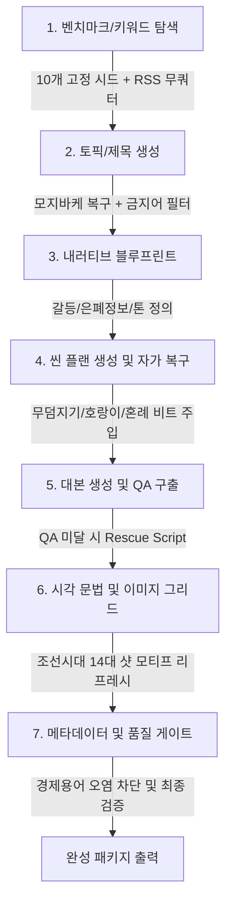

# Hermes 8개 카테고리 생성 로직 심층 분석 및 이식(Porting) 가이드

> **문서 목적**: 가장 많은 테스트와 반복 검증을 통해 고도화된 **`옛날이야기`** 카테고리의 생성/복구/품질관리 파이프라인 구조를 정밀 분석하고, 나머지 7개 카테고리(`탈북사연`, `해외감동`, `노후금융`, `황혼19금`, `한국사연`, `무협`, `경제`)와의 로직 차이점 및 결손 항목을 파악하여 동일 수준으로 고도화하기 위한 설계 및 이식 가이드라인을 제공합니다.

---

## 1. 개요 및 핵심 결론

* **`옛날이야기` 카테고리의 상태**:
  * 벤치마크 탐색부터 서브장르별(무덤지기, 호랑이사냥꾼, 과거시험, 혼례신부 등) **고유 비트 템플릿**, **씬 플랜 루핑/오염 자동 복구기**, **구출 대본(Rescue Script)**, **조선시대 전용 시각 모티프 리프레시(`_refresh_old_story_scene_visual_fields`)**, **경제 용어 오염 방지 품질 게이트**까지 7단계 전 과정에 걸쳐 가장 촘촘한 안전장치(Guardrails)가 구축되어 있습니다.
* **나머지 7개 카테고리의 현주소**:
  * `노후금융`과 `무협`은 일부 씬 플랜 복구 로직과 시각 문법이 부분 적용되어 있으나,
  * `해외감동`, `황혼19금`, `한국사연`, `탈북사연`, `경제`는 **서브타입별 비트 템플릿, 시각 모티프 리프레시, 전용 구출 대본, 상호 카테고리 오염 차단 필터**가 부재하거나 기초적인 수준에 머물러 있습니다.
* **핵심 과제**:
  * `옛날이야기`에서 검증된 **「7단계 방어 및 자가 복구 아키텍처」**를 모듈식 인터페이스로 추상화하여 7개 카테고리에 체계적으로 확장 이식해야 합니다.

---

## 2. `옛날이야기` 7단계 생성 파이프라인 분석



### Stage 1: 벤치마크 및 트렌드 키워드 탐색
* **고정 시드 키워드 (10개)**: AI 호출 없이 고정된 10개 시드(`조선시대 야담 실화`, `옛날 한국 풍습 미스터리`, `조선 기이한 이야기`, `한국 민간 설화 전설` 등)를 즉시 반환하여 API 쿼터 절약 및 엉뚱한 현대 키워드 차단.
* **RSS 관련성(Relevance) 필터**: `조선`, `선비`, `과거`, `양반`, `주막`, `시어머니`, `며느리`, `설화`, `전설`, `야사` 등 강한 관련성 단어로 피드 필터링.
* **오염 차단**: 경제 용어(`금값`, `코스피`, `환율`, `주가`, `부동산` 등) 및 현대 트렌드(`MZ`, `숏폼` 등) 완벽 배제.

### Stage 2: 토픽 및 제목 생성
* **프롬프트 가드레일**: `옛날이야기`, `민담`, `야사`, `해설` 등의 장르 라벨 자체를 제목에 노출하지 못하도록 금지.
* **제목 패턴**: 시대상(조선시대), 인물 관계(시어머니-며느리, 노인과 소년), 구체적 사건과 물건(보따리, 비녀, 족자 등) 중심 구체화.
* **모지바케 복구 (`_text_with_mojibake_repairs`)**: 인코딩 깨짐 발생 시 자동 교정 후 제목 확정.

### Stage 3: 내러티브 블루프린트 (Narrative Blueprint)
* **갈등 구조 (`central_conflict`)**: 권선징악의 표면적 도덕률 뒤에 숨겨진 가족사/약속/희생.
* **은폐 정보 (`hidden_information`)**: 초반 괴기/불길한 징조가 실은 주인공을 살리기 위한 선택이었음을 복선화.
* **톤앤매너**: `한국 옛날이야기 미스터리, 차분한 전설 분위기, 감동과 여운`.

### Stage 4: 씬 플랜(Structure) 생성 및 자가 복구 (핵심)
* **서브장르별 특화 비트 템플릿**:
  1. `_old_story_nameless_grave_grandmother_beats`: 무덤지기 / 이름 없는 무덤 서사
  2. `_old_story_tiger_claw_hunter_beats` & `_old_story_tiger_woodcutter_beats`: 착호갑사 / 호랑이 은혜/원한 서사
  3. `_old_story_wedding_bride_beats`: 40년 전 혼례 / 도망친 신부 서사
  4. `_old_story_exam_sons_mother_beats`: 삼형제 과거시험 / 어머니의 밥상 서사
* **씬 플랜 루핑/반복 감지 및 교정**:
  * `_repair_old_story_scene_plan_repetition`을 통해 모델이 동일한 씬 요약을 반복할 경우, 제목에 맞는 서브장르 템플릿으로 전체 씬 구조를 즉시 재배열.
  * 다른 카테고리(생존, 현대극) 비트가 침투했을 경우 즉시 정화(`_sanitize_old_story_scene_plan_to_title`).

### Stage 5: 대본 생성 및 Rescue Script
* **구출 대본 (`_build_old_story_grave_vigil_rescue_script`)**:
  * 섹션 분할 생성 시 AI가 대본 QA를 통과하지 못할 위험이 있는 대표 서사(무덤지기 등)에 대해 사전 검증된 완성도 높은 서사 뼈대를 바탕으로 구출 대본 생성.
* **품질 검증**: 어휘의 한국어 비율(Hangul Ratio > 0.8), 분량(최소 1,000자 이상 한글), 반복 문장 여부 검증.

### Stage 6: 시각 문법 & 2x2 이미지 그리드 프롬프트 모티프 갱신
* **시각 모티프 리프레시 (`_refresh_old_story_scene_visual_fields`)**:
  * AI가 생성한 비주얼 프롬프트가 추상적이거나 반복될 경우, 14대 조선시대 고유 비주얼 샷 모티프로 강제 교체:
    * `마을 입구 돌장승과 비탈길`
    * `초가집 뒤편 장독대와 짚신 자국`
    * `우물가 젖은 흙과 서리 낀 두레박`
    * `달빛 아래 흔들리는 한복 소매`
    * `호롱불 흔들리는 문살 그림자` 등.
* **컴팩트 이미지 그리드 템플릿**: 4개 패널(Top-Left, Top-Right, Bottom-Left, Bottom-Right) 일관성 유지.

### Stage 7: 메타데이터 및 품질 게이트
* **제목-대본 일치성 검증 (`_metadata_title_matches_script`)**: 제목의 핵심 단어가 대본 본문에 2개 이상 포함되었는지 형태소 단위 검증.
* **오염 차단 게이트 (`services/generation_quality_gate.py`)**: 옛날이야기 결과물에 `금값`, `코스피` 등 경제/현대 용어가 포함되면 즉시 반려.

---

## 3. 8개 카테고리 전체 비교 매트릭스

| 카테고리 | 1. 고정 시드 / RSS 필터 | 2. 프롬프트 프레임 | 3. 서브장르별 비트 템플릿 | 4. 씬 플랜 반복 자동 복구 | 5. 전용 구출 대본 | 6. 시각 모티프 리프레시 | 7. 품질 게이트 오염 필터 | 종합 완성도 |
| :--- | :---: | :---: | :---: | :---: | :---: | :---: | :---: | :---: |
| **옛날이야기** | **10개 / 완비** | **완비** | **4종 완비** | **완비 (다중 서브타입)** | **완비** | **완비 (14대 샷)** | **완비 (경제 오염)** | **100% (기준점)** |
| **탈북사연** | 4개 / 완비 | 완비 | 기본 1종 | 기본 복구만 존재 | **미비** | **미비** | **미비** | 50% |
| **해외감동** | 4개 / 완비 | 완비 | **미비** | **미비 (공통 fallback)** | **미비** | **미비** | **미비** | 35% |
| **노후금융** | 6개 / 완비 | 완비 | 기본 1종 | 완비 (`_repair_finance`) | **완비** | **미비** | **미비** | 70% |
| **황혼19금** | 4개 / 완비 | 완비 | **미비** | **미비 (공통 fallback)** | **미비** | **미비** | **미비** | 35% |
| **한국사연** | 4개 / 완비 | 완비 | **미비** | **미비 (공통 fallback)** | **미비** | **미비** | **미비** | 35% |
| **무협** | 4개 / 완비 | 완비 | 1종 완비 | 완비 (`_repair_martial`) | **미비** | **미비** | **미비** | 65% |
| **경제** | 7개 / 완비 | 완비 | 노후금융 공유 | 노후금융 공유 | 노후금융 공유 | **미비** | **미비** | 60% |

---

## 4. 카테고리별 상세 결손 항목 및 수정 과제

### (1) 탈북사연 (Survival Story)
* **현재 상태**: 단일 비트 템플릿(`_repair_survival_story_scene_plan_repetition`)만 존재하여 탈북 브로커, 국경선 넘기, 남한 정착기 등 다양한 서브장르 수용 한계.
* **필요 수정 사항**:
  1. **서브장르 비트 확충**: ① 국경 탈출/은신형, ② 남한 정착 갈등/편견 극복형, ③ 남겨진 가족/재회형 3종 분리.
  2. **시각 모티프 함수 신설 (`_refresh_survival_scene_visual_fields`)**: 두만강 얼음판, 야간 철조망, 위장 여권, 남한 임대아파트 베란다 등 12~14개 시각 모티프 구축.
  3. **구출 대본 신설 (`_build_survival_rescue_script`)**.
  4. **품질 게이트**: 정치적 선동 어휘 및 픽션형 무협/민담 용어 오염 차단.

### (2) 해외감동 (Overseas Touching)
* **현재 상태**: 카테고리 고유의 비트 템플릿과 씬 복구기가 없어 AI가 씬 플랜에서 루핑하면 일반 범용 템플릿으로 떨어짐.
* **필요 수정 사항**:
  1. **서브장르 비트 신설**: ① 외국인의 한국인 은인 찾기, ② 공항/국경에서의 기적적 도움, ③ 다문화 입양 및 가족 서사.
  2. **씬 복구 함수 신설 (`_repair_overseas_touching_scene_plan_repetition`)**.
  3. **시각 모티프 함수 신설 (`_refresh_overseas_scene_visual_fields`)**: 국제공항 입국장, 낡은 편지와 흑백 사진, 비 내리는 해외 거리, 통역 메모 등.
  4. **품질 게이트**: 영문 직역투/어색한 번역체 및 비현실적 판타지 요소 필터링.

### (3) 노후금융 (Retirement Finance)
* **현재 상태**: 씬 복구기(`_repair_finance_scene_plan_repetition`)와 구출 대본이 있으나 시각 프롬프트가 모호함.
* **필요 수정 사항**:
  1. **서브장르 비트 확충**: ① 은퇴 후 통장 잔고/사기 방어형, ② 자식 지원 갈등 및 졸혼 자금형, ③ 국민연금/소액 부동산 생계형.
  2. **시각 모티프 함수 신설 (`_refresh_finance_scene_visual_fields`)**: 돋보기 안경과 은행 통장, 아파트 관리사무소 야간 불빛, 낡은 가계부와 계산기 등.
  3. **품질 게이트**: 불법 리딩방/비현실적 투자 권유 어휘 필터링.

### (4) 황혼19금 (Twilight Relationship)
* **현재 상태**: 자극적인 제목 대비 씬 플랜이 단조롭고, 전용 복구기 및 시각 모티프가 전무함.
* **필요 수정 사항**:
  1. **서브장르 비트 신설**: ① 30년 만의 첫사랑 동창회 재회, ② 황혼 재혼과 자식들의 유산 갈등, ③ 배우자의 오랜 비밀 일기 발견.
  2. **씬 복구 함수 신설 (`_repair_twilight_scene_plan_repetition`)**.
  3. **시각 모티프 함수 신설 (`_refresh_twilight_scene_visual_fields`)**: 찻집 창가와 낡은 은반지, 노을 지는 교외 드라이브길, 닫힌 서재 문과 서랍 열쇠 등 (선정성을 배제하고 깊은 감정선과 미스터리 위주 비주얼).
  4. **품질 게이트**: 유튜브 가이드라인 위반 저속/음란 어휘 차단 및 성인 정서 멜로 유지.

### (5) 한국사연 (Korean Real-life Drama)
* **현재 상태**: 가장 대중적인 장르임에도 불구하고 전용 씬 복구기 및 시각 모티프 부재.
* **필요 수정 사항**:
  1. **서브장르 비트 신설**: ① 시댁/처가 명절 갈등과 통쾌한 반전, ② 직장 내 갑질 폭로와 내부 고발, ③ 이웃 간 층간소음/경계 침범 분쟁.
  2. **씬 복구 함수 신설 (`_repair_korean_drama_scene_plan_repetition`)**.
  3. **시각 모티프 함수 신설 (`_refresh_korean_drama_scene_visual_fields`)**: 아파트 엘리베이터 앞 CCTV, 변호사 상담실 서류 봉투, 가족 단체 식당 어색한 침묵 등.
  4. **품질 게이트**: 판타지/사극 요소 혼입 차단.

### (6) 무협 (Martial Arts / Wuxia)
* **현재 상태**: 씬 복구기(`_repair_martial_scene_plan_repetition`)는 잘 갖춰져 있으나 구출 대본 및 시각 모티프 갱신이 누락됨.
* **필요 수정 사항**:
  1. **시각 모티프 함수 신설 (`_refresh_martial_scene_visual_fields`)**: 폐허가 된 산문 현판, 비 내리는 대나무숲, 피 묻은 비급 목판, 주막 탁자 위 깨진 사발 등.
  2. **구출 대본 신설 (`_build_martial_rescue_script`)**: 사부의 복수 및 비급 봉인 해제 기본 완성형 스크립트.
  3. **품질 게이트**: 현대 문물/용어 오염 차단.

### (7) 경제 (Economy / Macro Market)
* **현재 상태**: `노후금융`과 섞여 있어 거시경제 해설 영상 특유의 구조가 부족함.
* **필요 수정 사항**:
  1. **서브장르 비트 신설**: ① 글로벌 환율/금리 쇼크 파급형, ② 특정 대기업/산업 공급망 위기형, ③ 부동산/원자재 사이클 예측형.
  2. **씬 복구 함수 신설 (`_repair_macro_economy_scene_plan_repetition`)**.
  3. **시각 모티프 함수 신설 (`_refresh_economy_scene_visual_fields`)**: 컨테이너 항만 전경, 증시 전광판 붉은 숫자, 중앙은행 회의장 마이크, 텅 빈 상가 거리 등.
  4. **품질 게이트**: 사연/감정적 내러티브 혼입 차단.

---

## 5. 단계별 포팅 및 구현 로드맵 (Action Plan)

### Step 1: 시각 모티프 리프레시 엔진 표준화 (`worker/hermes_worker.py`)
* `_refresh_old_story_scene_visual_fields` 패턴을 복제하여 7개 카테고리 함수 일괄 구현:
  * `_refresh_survival_scene_visual_fields`
  * `_refresh_overseas_scene_visual_fields`
  * `_refresh_finance_scene_visual_fields`
  * `_refresh_twilight_scene_visual_fields`
  * `_refresh_korean_drama_scene_visual_fields`
  * `_refresh_martial_scene_visual_fields`
  * `_refresh_economy_scene_visual_fields`
* `_category_visual_grammar`와 연동하여 씬 플랜 생성 직후 자동 호출하도록 디스패치 연결.

### Step 2: 카테고리별 서브타입 비트 템플릿 & 복구 핸들러 확장
* 각 카테고리별로 최소 2~3개의 대표 서브장르 비트 템플릿(각 10~15단계 기승전결) 작성.
* 씬 플랜 검증(`_validate_script_plan_stage`) 시 반복 발생 시 해당 카테고리 복구 함수로 라우팅.

### Step 3: 품질 게이트 오염 방지 상호 필터링 (`services/generation_quality_gate.py`)
* 현재 옛날이야기에만 존재하는 `_ECONOMY_TERMS` 오염 체크를 확장하여, **카테고리별 상호 배타적 금지어 맵** 구성:
  ```python
  CATEGORY_MUTUAL_CONTAMINATION_RULES = {
      "옛날이야기": ["금값", "코스피", "환율", "아파트", "MZ", "비행기"],
      "무협": ["스마트폰", "아파트", "달러", "주식", "경찰"],
      "경제": ["사부", "비급", "장문인", "도련님", "며느리", "초가집"],
      "탈북사연": ["장문인", "내공", "호랑이 사냥꾼", "조선시대"],
  }
  ```

### Step 4: 카테고리별 전용 구출 대본(Rescue Script) 완비
* 복잡한 섹션 생성 실패 시 백업으로 즉시 투입할 수 있는 표준 구출 뼈대 대본 생성 로직 확충.

### Step 5: 회귀 테스트 케이스 작성 (`tests/`)
* `tests/test_hermes_category_readiness.py`에 8개 카테고리 전체에 대한 씬 플랜 복구, 시각 모티프 갱신, 오염 차단 테스트 추가.

---

## 6. 요약 및 권장 착수 순서

1. **1차 작업 (시각 품질 및 씬 안정화)**:
   * 7개 카테고리 시각 모티프 리프레시 함수(`_refresh_{category}_scene_visual_fields`) 신설
   * 7개 카테고리 씬 플랜 반복 복구 핸들러(`_repair_{category}_scene_plan_repetition`) 신설
2. **2차 작업 (품질 게이트 및 오염 방지)**:
   * `generation_quality_gate.py`에 전 카테고리 상호 오염 방지 규칙 적용
3. **3차 작업 (대본 구출기 및 최종 테스트)**:
   * 미비 카테고리 Rescue Script 도입 및 8개 카테고리 E2E 오프라인 검증
